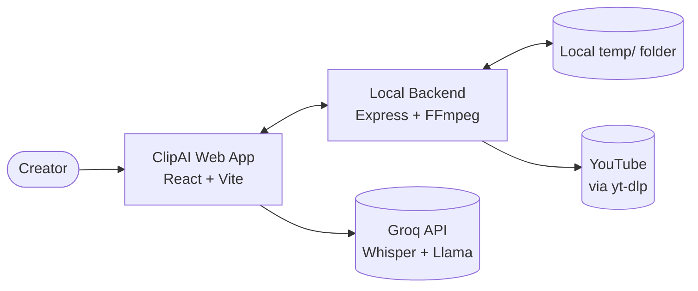
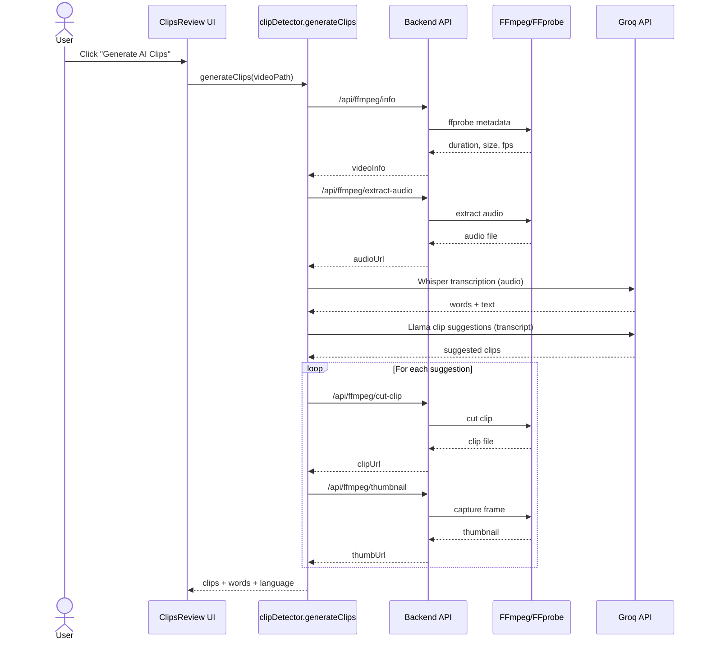

# ClipAI Architecture

## Summary
ClipAI is a local-first AI video editor for short-form content. The React + Vite web app runs against a local Express backend that wraps FFmpeg/FFprobe for media processing. Users upload or import a video, generate captions or AI-selected clips via Groq APIs, edit on a multi-track timeline, and export H.264 videos with optional burned-in subtitles. Media artifacts live in a local `temp/` folder, while project metadata is stored in browser `localStorage`.

## Current State

### System Context
ClipAI runs entirely on a creator’s machine. The frontend drives UI flows and calls the backend for file processing. AI calls (Whisper + Llama) are executed directly from the browser to Groq. YouTube imports are handled server-side with `yt-dlp`, with files or direct streams exposed under `/temp`.



### Component View
The frontend is organized around screens for projects, editing, captions, and AI clips. State is centralized in a Zustand store and shared across screens and components. The backend exposes `/api/files` for uploads/imports and `/api/ffmpeg` for processing jobs, with WebSocket updates for long-running exports.

```mermaid
flowchart LR
  subgraph Frontend["Frontend (React + Vite)"]
    screens[Screens\nHome, Projects, Editor,\nCaptionEditor, ClipsReview]
    components[Components\nTimeline, CaptionOverlay,\nExportSheet]
    store[State\nZustand editorStore]
    api[Services\napi.js (REST + WS)]
    groq[Services\ngroq.js (Groq API)]
    clipDetector[Services\nclipDetector.js]
    screens --> store
    screens --> components
    screens --> api
    screens --> clipDetector
    clipDetector --> groq
  end

  subgraph Backend["Backend (Express)"]
    files[Routes\n/api/files]
    ffmpegRoutes[Routes\n/api/ffmpeg]
    ws[WebSocket\nprogress updates]
    ffmpegSvc[Services\nffmpeg.js]
    captionSvc[Services\ncaptionRenderer.js]
    files --> ffmpegSvc
    ffmpegRoutes --> ffmpegSvc
    ffmpegRoutes --> ws
  end

  api <--> files
  api <--> ffmpegRoutes
```

### Data Flow
- **Upload/import**: Frontend uploads media → `/api/files/upload` → FFprobe extracts metadata → media served from `/temp`.
- **YouTube import**: Frontend calls `/api/files/download-youtube` → `yt-dlp` downloads or streams → metadata returned → video stored in `/temp`.
- **Caption generation**: Frontend requests `/api/ffmpeg/extract-audio` → audio served from `/temp` → browser sends audio to Groq Whisper → words stored in Zustand/localStorage.
- **AI clips**: Frontend composes transcript → Groq Llama returns clip suggestions → backend `cut-clip` + `thumbnail` per suggestion → results persisted in state.
- **Export**: Frontend generates ASS captions → `/api/ffmpeg/burn-captions` or `/reencode` → WebSocket progress → output saved to `/temp`.

### Deployment View
- **Frontend**: Vite dev server on `http://localhost:5173`.
- **Backend**: Express server on `http://localhost:3001`, serving `/api/*` and `/temp/*`.
- **Processes**: `npm run start` launches both (via `concurrently`).
- **Storage**: local filesystem `temp/` for media; browser `localStorage` for project state.
- **AI**: Groq API calls from browser using `VITE_GROQ_API_KEY`.

## Gaps / Decisions
- Groq API key is exposed in the client (no server-side proxy).
- Project persistence relies on `localStorage` (no DB, no cloud sync).
- FFmpeg jobs are in-process only (no queue or retries).
- Long audio chunking is manual (no automatic Whisper chunking).
- Temp storage is local-only with 12h cleanup (no lifecycle management).
- YouTube import requires local `yt-dlp` installation.
- No auth, sharing, or collaboration model.

## Near-term Roadmap
1. Move Groq calls to backend and secure API keys.
2. Add persistent project storage (local DB or cloud).
3. Introduce job queue + worker for FFmpeg processing.
4. Auto-chunk long audio for Whisper and stitch transcripts.
5. Improve YouTube import fallback paths and dependency checks.

## Out of Scope
- Native mobile apps or Electron packaging.
- Real-time multi-user collaboration.
- Social publishing/scheduling features.
- Advanced color grading or pro audio workflows.

## Appendix

### Generate AI Clips Pipeline (Sequence)


### Key Endpoints
- `POST /api/files/upload`
- `POST /api/files/download-youtube`
- `GET /api/files/list`
- `DELETE /api/files/cleanup`
- `POST /api/ffmpeg/info`
- `POST /api/ffmpeg/extract-audio`
- `POST /api/ffmpeg/cut-clip`
- `POST /api/ffmpeg/trim`
- `POST /api/ffmpeg/speed`
- `POST /api/ffmpeg/crop`
- `POST /api/ffmpeg/thumbnail`
- `POST /api/ffmpeg/burn-captions` (async, WebSocket progress)
- `POST /api/ffmpeg/reencode` (async, WebSocket progress)

### Environment Variables
- `VITE_GROQ_API_KEY` (browser-exposed)
- `PORT` (backend, default 3001)

### Storage Model
- Media assets: `temp/` served at `http://localhost:3001/temp/*`
- Project metadata: `localStorage` key `clipai_projects`
