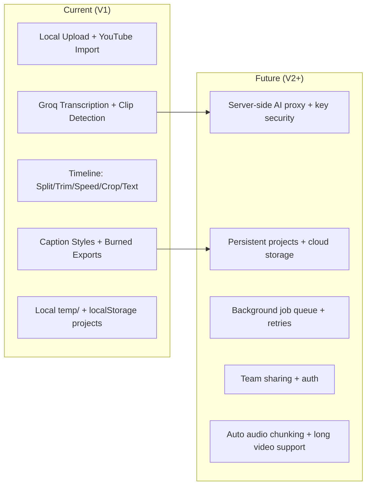

# ClipAI PRD (V1)

## Summary (Current)
ClipAI is a local-first AI video editor for short-form content. It runs as a React + Vite web app with a local Express + FFmpeg backend. Users import a video, generate AI captions or AI-selected clips via Groq, edit on a timeline, then export with burned captions. All media is stored in a local `temp/` folder and projects are saved in browser `localStorage`.

## Current State (Source of Truth)
### Product Workflow (Current)
- Import source video (local upload or YouTube via `yt-dlp`).
- Choose mode: Caption, Clips (AI shorts), or Editor.
- AI transcription (Groq Whisper) → word-level captions.
- AI clip detection (Groq Llama) → cut 30–60s shorts.
- Timeline editing: split, trim, speed, crop, text overlays, captions.
- Export: re-encode or burn captions with FFmpeg; download from `/temp`.

### Frontend (Current)
- React + Vite + Tailwind + Zustand state.
- Routes: `/` (Home), `/projects`, `/editor`, `/captions`, `/clips`.
- Project persistence in `localStorage` (`clipai_projects`).
- Live playback with caption overlay + timeline tracks (V1/A1/T1/C1).

### Backend (Current)
- Express server on `:3001` with static `/temp` media hosting.
- FFmpeg/FFprobe via `fluent-ffmpeg` + `ffmpeg-static`.
- WebSocket for long-running job progress (burn/reencode).
- APIs for upload, metadata, trimming, speed, crop, captions, YouTube import.

### AI (Current)
- Groq Whisper (`whisper-large-v3-turbo`) for transcription (client-side).
- Groq Llama (`llama-3.3-70b-versatile`) for clip detection (client-side).
- VITE Groq key is exposed to the browser.

### Storage (Current)
- Video/audio/exports in local `temp/` directory.
- Browser `localStorage` holds project metadata and captions.
- No database, no cloud storage, no user accounts.

### Mermaid: User Journey Flow (Current)
```mermaid
flowchart LR
  A[Open App] --> B{Import Video}
  B --> C[Local Upload]
  B --> D[YouTube Import]
  C --> E[Projects]
  D --> E
  E --> F{Choose Mode}
  F --> G[Caption Editor]
  F --> H[AI Clips Review]
  F --> I[Timeline Editor]
  G --> I
  H --> I
  I --> J[Export (FFmpeg)]
  J --> K[Download from /temp]
```

## Gaps / Decisions (Future Required)
**Current gaps:**
- Groq API key is client-exposed; no server-side proxy.
- No project persistence beyond `localStorage`.
- No multi-user/auth; no collaboration or sharing.
- No job queue; long FFmpeg jobs are in-process only.
- No auto-chunking for >25MB Whisper audio (manual only).
- Temp storage is local-only; cleanup is manual/12h sweep.
- YouTube import requires local `yt-dlp` installed.

**Decisions to make:**
- Host model calls server-side vs. keep client-side.
- Persistent storage choice (local DB vs. cloud object storage).
- Background processing strategy (queue + workers).
- Max file sizes, cleanup policy, and security constraints.
- Export targets (local download only vs. cloud links).

### Mermaid: Feature Scope Swimlane (Current vs Future)


## Near-term Roadmap (Future)
1. **Secure AI calls**: move Groq calls to backend, store keys server-side.
2. **Persistent projects**: add DB + object storage (local or cloud).
3. **Job queue**: background FFmpeg jobs with retries and status polling.
4. **Audio chunking**: split long audio for Whisper and stitch transcripts.
5. **Robust imports**: verify `yt-dlp` availability and fallback to stream mode.

## Out of Scope (Explicit)
- Mobile native apps or Electron packaging.
- Real-time multi-user collaboration.
- Marketplace/publishing or social scheduling.
- Advanced color grading and pro audio workflows.

## Appendix
### Key Endpoints (Current)
- `POST /api/files/upload` (video upload)
- `POST /api/files/download-youtube` (yt-dlp download/stream)
- `GET /api/files/list` (temp listing)
- `DELETE /api/files/cleanup` (12h cleanup)
- `POST /api/ffmpeg/info` (metadata)
- `POST /api/ffmpeg/extract-audio`
- `POST /api/ffmpeg/cut-clip`
- `POST /api/ffmpeg/trim`
- `POST /api/ffmpeg/speed`
- `POST /api/ffmpeg/crop`
- `POST /api/ffmpeg/thumbnail`
- `POST /api/ffmpeg/burn-captions` (async via WS)
- `POST /api/ffmpeg/reencode` (async via WS)

### Environment Variables (Current)
- `VITE_GROQ_API_KEY` (browser-exposed)

### Storage Model (Current)
- Media: `temp/` (served at `http://localhost:3001/temp/*`)
- Projects: `localStorage` key `clipai_projects`
