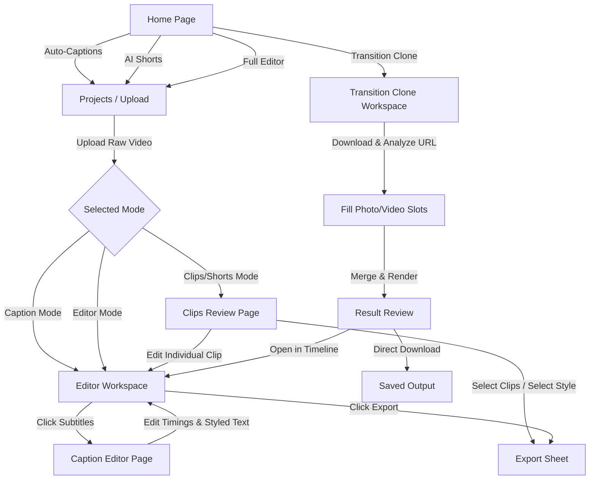

# Product Requirements Document (PRD) — ClipAI

**Project Name:** ClipAI  
**Version:** 1.0.0  
**Status:** Approved  
**Author:** AI Product Management Team  
**Date:** May 27, 2026  

---

## 1. Executive Summary & Vision

### 1.1 Product Vision
ClipAI is a premium, web-based, local-first AI video editor designed for modern content creators, social media managers, and editors. By combining a classic multi-track timeline editing interface with cutting-edge artificial intelligence, ClipAI enables users to produce high-impact, short-form viral videos (Reels, TikToks, Shorts) in a fraction of the time. 

### 1.2 The Problem
Short-form video platforms demand constant high-volume uploads. However, the video creation process is bottlenecked by:
*   **Tedious Captioning:** Manually transcribing, syncing, and styling captions is slow and repetitive.
*   **Finding Viral Hooks:** Reviewing long-form video (vlogs, podcasts) to extract viral clips is highly time-consuming.
*   **Complex Tooling:** Heavy desktop editors (Premiere, DaVinci Resolve) have steep learning curves, while mobile tools lack precise screen real estate for advanced editing.
*   **Transition Replicating:** Cloning trending transitions (slideshows, overlays, visual cuts synced to beats) from social media is highly technical and requires manual frame alignment.

### 1.3 The Solution
ClipAI solves this by offering a dual-mode workspace:
1.  **AI Shorts & Auto-Captions:** Automated workflows that use AI to transcribe audio, detect viral segments, auto-generate stylized subtitles, and cut the video.
2.  **Transition Reel Clone:** An adaptive template engine that downloads trending social media videos, detects scene cuts and speed ramps, and lets creators swap in their own photos or videos to recreate the trend in seconds.
3.  **Timeline-Based Editing:** A rich, responsive desktop-class timeline (similar to CapCut and VN Editor) with visual splitting, trimming, speed adjustments, and caption styling controls.

---

## 2. Product Goals & Objectives

*   **Speed-to-Publish:** Reduce the time to convert a 30-minute podcast or raw vlog into 5 ready-to-publish shorts from hours to under 3 minutes.
*   **Visual WOW Factor:** Deliver a premium, immersive user interface featuring a deep-space dark theme, glassmorphic UI panels (`backdrop-filter: blur`), glowing neon highlights, and smooth Framer Motion animations.
*   **Local-First Processing:** Keep video file uploads local, processing them on the user's local machine via an Express backend and FFmpeg binary, avoiding expensive cloud-rendering fees and slow network uploads.
*   **High-Accuracy Multi-lingual Subtitles:** Leverage the Groq API (Whisper) for lightning-fast English, Hindi, and Hinglish transcriptions, automatically applying optimized style presets for different language contexts.

---

## 3. User Workflows & Journeys

ClipAI operates via three distinct workflows:

### 3.1 Workflow A: The Standard/Manual Timeline Flow
*   **Step 1:** The user clicks "Editor" on the home page and uploads a raw video.
*   **Step 2:** The project is initialized in `localStorage` and opened in the **Main Editor**.
*   **Step 3:** The user performs cuts, splits, trims, scales clips, adjusts playback speeds, or adds text overlays using the timeline.
*   **Step 4:** The user clicks **✦ Caption** to auto-generate or refine word-level subtitles.
*   **Step 5:** The user exports the finished video via the slide-up **Export Sheet**, burning the styled subtitles directly into the video or saving them as an external `.srt` file.

### 3.2 Workflow B: The AI Shorts Generator Flow
*   **Step 6:** The user clicks "Clipping" on the home page and uploads a long-form video.
*   **Step 7:** The system extracts the audio, transcribes it via Whisper, detects the primary language, and sends the timestamped transcript to LLaMA 3.3.
*   **Step 8:** LLaMA 3.3 returns 5–8 engaging short segments, complete with attention-grabbing titles, hooks, viral scores (1-10), and editorial reasons.
*   **Step 9:** The user lands on the **Clips Review Page**, where they preview the generated shorts with auto-synced subtitles.
*   **Step 10:** The user can select individual clips to tweak in the **Main Editor** or select multiple clips for immediate **Bulk Export**.

### 3.3 Workflow C: The Transition Reel Clone Flow
*   **Step 11:** The user enters the URL of an Instagram Reel, YouTube Short, or TikTok video.
*   **Step 12:** The backend downloads the video, analyzes frame changes to pinpoint scene cuts, and uses LLaMA 3.3 to classify the transition technique and build an editing "recipe".
*   **Step 13:** The user uploads their own media files into the template slots, arranges them via drag-and-drop or simple navigation buttons, and enters a custom name.
*   **Step 14:** The backend renders the customized media assets over the template's timeline structure and audio track, yielding a professionally synced video.

---

## 4. Detailed Screen Requirements

### 4.1 Home Screen (`Home.jsx`)
*   **Core Purpose:** Application landing page and workspace manager.
*   **UI Components:**
    *   **Header Bar:** App logo ("✦ ClipAI"), global project controls (Save, Undo, Redo).
    *   **Feature Cards:** Three layout cards (Caption, Clipping, Editor) with hover micro-animations and style tags. Clicking redirects to the Projects Manager.
    *   **Recent Projects:** Displays a list of the last 4 active projects with thumbnails, durations, timestamps, and quick-action buttons (Open, Rename, Delete).
    *   **Continue Editing:** Horizontal scrolling carousel of unfinished projects showing active progress indicators (e.g., "Caption 30%").

### 4.2 Projects / Import Manager (`Projects.jsx`)
*   **Core Purpose:** Centralized repository for imported media and projects.
*   **UI Components:**
    *   **Import Upload Card:** Drag-and-drop file uploader (supports `.mp4`, `.mov`, `.avi`, `.mkv` up to 4GB) with visual hover states and upload progress trackers.
    *   **Search & Filter Bar:** Text search input, category filters (All, Caption, Clipping, Editor), and sorting options (Recent, Name, Size).
    *   **Projects Grid:** Visual card gallery representing existing projects. Cards show aspect-video thumbnails, video durations, project mode badges, creation dates, and action menus (Rename, Delete, Export).

### 4.3 Main Editor Workspace (`Editor.jsx`)
*   **Core Purpose:** The central video editing canvas and timeline interface.
*   **UI Layout (CSS Grid):**
    *   **Left Toolbar (56px width):** Fast-action buttons for Split (scissors), Trim (crop), Crop, Speed, Audio, Text, Transition, Caption, and Resize.
    *   **Center Preview Panel:** 16:9 or 9:16 interactive video player synced with the active timeline. Includes custom playback controls (Play/Pause, Skip Back/Forward, Volume slider, Fullscreen, Timecode display).
    *   **Right Properties Panel (280px width):** Dynamic settings area that displays context-aware controls for the selected tool (e.g., aspect ratios for Crop, speed multipliers for Speed, font controls for Text, or transition thumbnails).
    *   **Bottom Timeline Panel (160px height):** A multi-track layout showing Video (`V1`), Audio (`A1`), Text (`T1`), and Captions (`C1`) tracks. Supports zoom controls, absolute playhead dragging, visual clip blocks with resizing handles, and track lock/visibility controls.

### 4.4 Caption Editor (`CaptionEditor.jsx`)
*   **Core Purpose:** Detailed customization of auto-generated or custom subtitles.
*   **UI Layout:**
    *   **Left Column (44%):** Vertical 9:16 phone preview emulator showing the selected caption style preset overlaid on the video frame, plus playback and font-style controls.
    *   **Right Column (56%):** Scrollable list of timestamped caption cards. Cards display active timing indicators, editable text textareas, start/end timing adjustment increments (±0.1s), and delete buttons. The list automatically scrolls to keep the currently spoken caption card in view.
    *   **Bottom Bar:** "Reset to AI" default option and a primary "Save & Return" CTA that writes updates back to the editor store.

### 4.5 Clips Review (`ClipsReview.jsx`)
*   **Core Purpose:** Curation hub for AI-generated viral short clips.
*   **UI Components:**
    *   **Loading Stepper:** Conic-gradient spinner with status updates highlighting the active pipeline step: *Extracting Audio → Transcribing → AI Analysis → Cutting Clips*.
    *   **Clips Gallery:** Responsive grid of 9:16 video cards. Each card displays an auto-extracted thumbnail, a color-coded quality score badge (e.g., "✦ 9.2" in green), clip duration, video title, social media hook text, and actions (Preview, Edit in Timeline, Export).
    *   **Preview Modal:** Immersive overlay player looping the selected clip with stylized subtitles.
    *   **Bottom Action Bar:** Selection count indicators, selection toggles (Select/Deselect All), and bulk export CTA button.

### 4.6 Transition Clone Workspace (`TransitionClone.jsx`)
*   **Core Purpose:** Recreating viral video trends using local media files.
*   **UI Components:**
    *   **URL Submission Panel:** A paste input that auto-detects social platforms (Instagram, YouTube, TikTok) and triggers backend downloading/processing.
    *   **Pipeline Loader:** Multi-stage stepper showing the reference video parsing progress.
    *   **Visual Layout Blueprint:** Renders a visual color-coded horizontal timeline of detected cuts, overlay layers, and background segments.
    *   **Media Dropzone Slots:** A grid of fillable boxes representing each slot in the transition sequence. Supports bulk photo selection, visual status indicators (unfilled, uploading, ready), hover details (slot duration, animation presets), and drag-and-drop slot swapping.
    *   **Export Controls:** File output naming inputs, rendering progress bars, and direct link download triggers.

---

## 5. Non-Functional Requirements

### 5.1 Performance
*   **Render Efficiency:** The application must utilize GPU acceleration via FFmpeg where available. All stream operations (like cutting clips) should use stream copy (`-c copy`) to avoid transcoding latency.
*   **UI Fluidity:** Heavy state calculations (such as timeline drag offsets or volume calculations) must be handled reactively in Zustand, keeping transitions at 60 FPS.
*   **Offline Capability:** Since all media editing operations run on the local Node.js server, the app must remain functional without an active internet connection (excluding the external Groq transcription requests).

### 5.2 Storage & File Management
*   **Media Security:** Raw uploaded video files must remain inside the local project folder (`./temp/`).
*   **Automated Maintenance:** The server must expose a file cleanup route to sweep and purge temporary files older than 12 hours, capping the app's local disk usage.
*   **Large File Support:** The file uploader must support video inputs of up to 4GB, handled via Multer disk storage streams to prevent server RAM overflow.

### 5.3 Extensibility
*   **Plugin Architecture:** Frontend states should be designed so that new editing tracks, styles, or transcription models can be added by declaring additional state nodes without breaking existing timeline properties.
*   **Modular API Routing:** Server endpoints are isolated into dedicated routers (`/api/ffmpeg`, `/api/files`, `/api/transitions`) to facilitate future migrations or scale-ups to cloud architectures (e.g., Supabase, AWS EC2).
